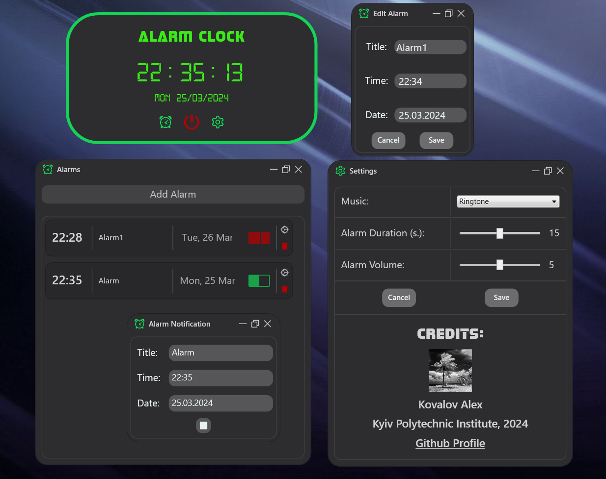

<h1 align="center">Alarm Clock</h1>

**WPF Alarm Clock Application with C# and .NET 8.**<br>


**Using this repo you agree not to violate the rules of academic integrity.**
Not for commercial use.

<h2>Tech stack:</h2>

- **C#**
- **.NET 8**
- **Windows Presentation Foundation (WPF)**
- **SyncFusion Controls**

<h2>Description</h2>

This project is a feature-rich alarm clock application developed using C# and .NET 8, leveraging the power of Windows Presentation Foundation (WPF).
It offers users a comprehensive set of functionalities, including standard clock features along with alarm management capabilities.



With its combination of essential clock functionalities and advanced alarm management features,
this WPF alarm clock application offers users a convenient and customizable solution for their timekeeping needs.

<h2>Key Features</h2>

- **Clock Display**: The application provides users with a clear and accurate display of the current time.
- **Alarm Functionality**: Users can set multiple alarms, each customizable with unique settings such as time, date, and label.
- **Alarm Management**: The application allows users to add, edit, and delete alarms effortlessly, providing seamless control over their alarm settings.
- **Sound Selection**: Users can choose from a variety of built-in melodies or import their own sounds to use as alarm tones.
- **Volume Control**: The application offers adjustable volume settings for alarm tones, ensuring users can set the desired level of sound intensity.
- **User Interface**: Designed with a user-friendly interface, the application provides intuitive navigation and easy access to all features.
- **Customization Options**: Users have the flexibility to personalize the application according to their preferences, including volume of alarms or their duration.
- **Reliable Performance**: Built on the robust .NET 8 framework, the application ensures stability and reliability in operation.

<h2>Contributions</h2>

**Contributions are welcome!** 🎉

It's better to create an issue with description of your **bug/feature** before creating pull requests.

<h3>About branching</h3>

This project uses **TBD git strategy**.

Each contributor should have a branch. **Naming example:** ```feat/<nickname>```